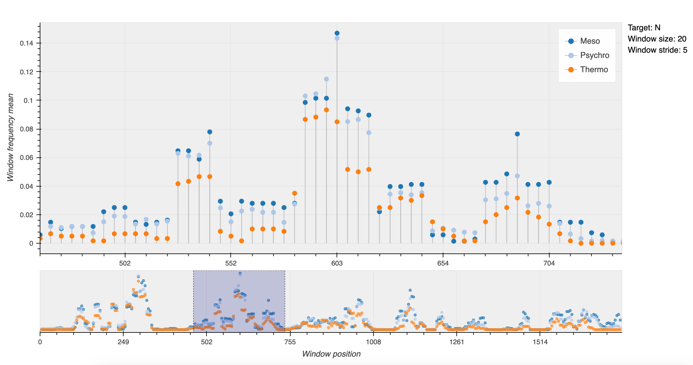

# sliding-window-analysis

### Setup and run instuctions

1) Download or clone this repository.

2) Download, install, then open [Docker desktop](https://www.docker.com/products/docker-desktop).

3) Move or copy the directory containing the FASTA files you wish to analyze into the `sliding-window-analysis` directory

4) Open a command line interface and change your working directory to the sliding-window-analysis directory, for example

        cd example/path/to/directory/sliding-window-analysis

<!-- Build the docker image and specify the path to the directory containing your [FASTA files](https://en.wikipedia.org/wiki/FASTA_format) (note: the FASTA file directory must be in the sliding-window-analysis directory)

    docker-compose build --build-arg path_to_data=sliding-window-analysis/example/path/ -->

5) To excute the program, use `docker-compose run` at the command line

        docker-compose run sliding_window path_to_data target window_size n_largest --stride --colors

The program parameters are `path_to_data`, `target`, `window_size`, `n_largest`, and optionally, `--stride` and `--colors`.

For documentation on the program's parameters, run

    docker-compose run sliding_window -h

<!-- The path_to_data argument should be the same as the one provided in the docker-compose build command.  -->

### Examples

#####With a single `target` "G" and no optional arguments

    docker-compose run sliding_window data/raw/ G 20 50

After running this command, the program's output should now be in the generated "results" subdirectory

#####With multiple targets ("T", "C", and "A") and the optional `--stride` and `--colors` arguments

    docker-compose run sliding_window data/raw/ TCA 10 20 --stride 10 --colors blue green yellow

###Installing and running the program without Docker

If you wish to run the program without docker, you must have python 3.9 or later installed (earlier versions may work, but have not been tested), then follow steps 1-4 as above. Next, install the program's requirements with

    pip install -r requirements.txt

Then run the program with

    python3 run.py path_to_data target window_size n_largest --stride --colors

For example,

    python3 run.py data/raw/extremofiles N 20 50 --stride 5
